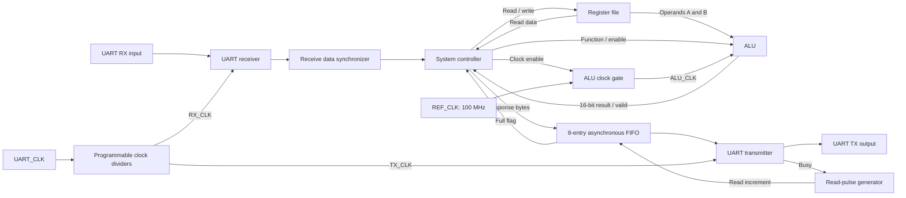

# RTL-to-GDSII Implementation of a Low-Power Configurable Multi-Clock Digital System

A UART-controlled digital system implemented in Verilog/SystemVerilog and taken through synthesis, scan DFT, formal equivalence, physical implementation, gate-level functional simulation, and GDSII export using a **TSMC 130 nm standard-cell technology**.

This repository documents the work completed at each stage, including the RTL, tool scripts, netlists, verification outputs, timing reports, and physical-design exports.

## Contents

- [System overview](#system-overview)
- [Architecture](#architecture)
- [Clock and register configuration](#clock-and-register-configuration)
- [Command interface](#command-interface)
- [Implementation flow](#implementation-flow)
- [Recorded results](#recorded-results)
- [Repository layout](#repository-layout)
- [Getting started](#getting-started)
- [Delivered files and handoff notes](#delivered-files-and-handoff-notes)

## System Overview

The system receives commands through UART, performs register-file or ALU operations, and returns the requested data through UART. Computation and serial communication operate in separate clock domains.

### Implemented features

- **100 MHz reference-clock target** for the controller and register file.
- **Configurable UART** with 8-bit data, optional even/odd parity, and a nominal 115200-baud operating point.
- **16-bit ALU result path** with arithmetic, logic, comparison, and shift operations.
- **16 x 8-bit register file** containing operands, UART settings, and the clock-division ratio.
- **8 x 8-bit asynchronous transmit FIFO** between the reference and UART transmit domains.
- **Two-stage pointer and reset synchronizers**, plus a receive-data enable synchronizer.
- **State-controlled ALU clock gating** using the `TLATNCAX12M` technology cell.
- **Four scan chains** with test-mode clock and reset selection.
- Formal equivalence checkpoints after synthesis, DFT insertion, and physical implementation.

The low-power feature is ALU clock gating. The controller requests the ALU clock during execution states; test-mode and reset overrides preserve clock access when required.

## Architecture

The receive path transfers UART bytes into the reference-clock domain for command processing. Response bytes pass through the asynchronous FIFO into the UART transmit domain.



The original system specification is available in [Specs](./Specs). The integrated RTL is [SYS_TOP.v](./Frontend/rtl/SYS_TOP.v).

## Clock and Register Configuration

### Clocks

| Clock | Configured period | Purpose |
|---|---|---|
| `REF_CLK` | 10 ns | 100 MHz reference-domain target |
| `ALU_CLK` | 10 ns while enabled | Gated reference clock |
| `UART_CLK` | 271.30 ns | Nominal 3.6864 MHz UART parent clock |
| `RX_CLK` | 271.30 ns at prescale 32 | UART receive sampling |
| `TX_CLK` | 8681.60 ns | UART parent clock divided by 32 |
| `DFTCLK` | 200 ns | Scan timing mode |

The receiver implements majority sampling at prescales **8, 16, and 32**, with receive division ratios **4, 2, and 1**, respectively.

### Reserved registers

| Address | Register | Reset value | Use |
|---|---|---|---|
| `0x0` | `REG0` | `0x00` | ALU operand A |
| `0x1` | `REG1` | `0x00` | ALU operand B |
| `0x2` | `UART_Config` | `0x81` | Parity enabled, even parity, prescale 32 |
| `0x3` | `DIV_RATIO` | `0x20` | Transmit division ratio 32 |
| `0x4`-`0xF` | General registers | `0x00` | Read/write byte storage |

In `UART_Config`, bit 0 enables parity, bit 1 selects parity type, and bits 7:2 hold the receive prescale.

See [Register_File.v](./Frontend/rtl/Register_File.v), [ClkDiv.v](./Frontend/rtl/ClkDiv.v), and [ClkDiv_mux.v](./Frontend/rtl/ClkDiv_mux.v).

## Command Interface

Each item in the incoming sequence is an 8-bit UART data byte.

| Operation | Opcode | Incoming sequence | Response |
|---|---|---|---|
| Register write | `0xAA` | Opcode, address, data | No response byte |
| Register read | `0xBB` | Opcode, address | One register-data byte |
| ALU with new operands | `0xCC` | Opcode, operand A, operand B, function | Low result byte, then high result byte |
| ALU with stored operands | `0xDD` | Opcode, function | Low result byte, then high result byte |

The ALU implements addition, subtraction, multiplication, division, AND, OR, NAND, NOR, XOR, XNOR, equality/greater-than/less-than comparisons, and single-bit left/right shifts.

Command sequencing is implemented in [sys_ctrl.sv](./Frontend/rtl/sys_ctrl.sv); function encoding is defined in [ALU.v](./Frontend/rtl/ALU.v).

## Implementation Flow

| Stage | Work completed | Files |
|---|---|---|
| 1. RTL implementation | Implemented the datapath, controller, UART, FIFO, synchronizers, dividers, and clock gate | [RTL sources](./Frontend/rtl) |
| 2. RTL lint and CDC | Configured SpyGlass goals, clock domains, synchronizer recognition, and waivers; saved check outputs | [SpyGlass](./Frontend/SpyGlass) |
| 3. Logic synthesis | Applied clock, uncertainty, I/O, drive, and load constraints; ran `compile_ultra` and generated mapped results | [Synthesis](./Frontend/Synthesis) |
| 4. Post-synthesis equivalence | Compared RTL and the synthesized netlist using Formality | [Post-synthesis Formality](./Backend/formality/post-syn) |
| 5. Scan DFT | Added test ports and clock/reset selection; inserted four chains and estimated stuck-fault coverage | [DFT](./Backend/DFT) |
| 6. Post-DFT equivalence | Checked functional behavior after scan insertion with test controls low | [Post-DFT Formality](./Backend/formality/post-dft) |
| 7. Physical implementation | Imported the design, loaded the floorplan, placed cells, built clock trees, added power routing, routed signals, and inserted fillers | [PNR](./Backend/PNR) |
| 8. Timing and physical checks | Saved post-CTS/post-route timing and geometry, connectivity, and process-antenna results | [Timing reports](./Backend/PNR/Timing%20Reports) / [Physical checks](./Backend/PNR/Reports) |
| 9. Post-PNR equivalence | Compared the physical netlist in functional mode | [Post-PNR Formality](./Backend/formality/post-pnr) |
| 10. Functional simulation | Ran the recorded command workload and retained the successful checker results | [GLS simulation](./Backend/GLS/sim) |
| 11. Power and export | Produced PrimeTime PX power outputs and the supplied netlist, delay, parasitic, and GDSII artifacts | [Power analysis](./Backend/GLS/pt) / [Exports](./Backend/PNR/Export) |

### Tools used

| Work | Tool |
|---|---|
| RTL design | Verilog / SystemVerilog |
| Lint and CDC | Synopsys SpyGlass |
| Synthesis and scan insertion | Synopsys Design Compiler / DFT flow |
| Equivalence checking | Synopsys Formality |
| Placement, CTS, and routing | Cadence First Encounter / NanoRoute |
| Netlist functional simulation | QuestaSim / ModelSim flow |
| Time-based power estimation | Synopsys PrimeTime PX |

## Recorded Results

These values come from the saved project outputs.

| Item | Recorded result | Output |
|---|---|---|
| Synthesized cells | 2166 | [Synthesis area report](./Frontend/Synthesis/reports/area.rpt) |
| Synthesized cell area | 25600.285224 library area units | [Synthesis area report](./Frontend/Synthesis/reports/area.rpt) |
| Scan chains | 96, 96, 96, and 95 elements; 383 total | [DFT netlists and SCANDEF](./Backend/DFT/netlists) |
| Estimated stuck-fault test coverage | 99.44% | [DFT log](./Backend/DFT/log/dft.log) |
| Post-synthesis equivalence | SUCCEEDED; 391 passing points | [Formality log](./Backend/formality/post-syn/logs/syn_fm_log.log) |
| Post-DFT equivalence | SUCCEEDED; 391 passing points | [Formality log](./Backend/formality/post-dft/logs/dft_fm_log.log) |
| Post-PNR equivalence | SUCCEEDED; 391 passing points | [Formality log](./Backend/formality/post-pnr/logs/pnr_fm_log.log) |
| Post-route setup WNS | +0.127 ns | [Setup summary](./Backend/PNR/Timing%20Reports/SYS_TOP_postRoute.summary) |
| Post-route hold WNS | +0.082 ns | [Hold summary](./Backend/PNR/Timing%20Reports/SYS_TOP_postRoute_hold.summary) |
| Post-route timing violations | 0; TNS = 0.000 ns | [Timing summaries](./Backend/PNR/Timing%20Reports) |
| Successful functional checks | 20 | [Simulation transcript](./Backend/GLS/sim/transcript) |
| Preliminary time-based total power | 26.36 uW | [PrimeTime PX report](./Backend/GLS/pt/report/SYS_TOP_pw.rpt) |

The functional workload included 17 receive-flag checks, a register read returning `0x55`, an addition response byte of `0x23`, and a subtraction response byte of `0xFB`.

**Power note:** the 26.36 uW value is a preliminary estimate. VCD mapping annotated 8.37% of nets and fully annotated 2.42% of leaf cells, so power may be underestimated. No measured percentage saving against an ungated baseline is claimed. See the [activity log](./Backend/GLS/pt/pw.log).

## Repository Layout

```text
.
+-- Frontend
|   +-- rtl          Verilog/SystemVerilog implementation
|   +-- SpyGlass     Lint/CDC project, constraints, reports, waivers
|   +-- Synthesis    Synthesis scripts, netlists, logs, and reports
+-- Backend
|   +-- DFT          Scan insertion, SCANDEF, SDC, SDF, and reports
|   +-- formality    Post-synthesis, post-DFT, and post-PNR checks
|   +-- PNR          Floorplan, CTS, routing records, checks, exports
|   +-- GLS
|       +-- sim      Netlist simulation, testbench, transcript, VCD
|       +-- pt       PrimeTime PX setup and power results
+-- Specs            Frontend and backend specification PDFs
+-- std_cells        Standard-cell timing libraries and models
```

## Getting Started

### Clone the repository

```powershell
git clone https://github.com/ahmedsamir003/RTL-to-GDS-Implementation-of-Low-Power-Configurable-Multi-Clock-Digital-System.git
Set-Location ".\RTL-to-GDS-Implementation-of-Low-Power-Configurable-Multi-Clock-Digital-System"
```

### Review the completed work

1. Read the [frontend specification](./Specs/Frontend.pdf) and [backend assignment](./Specs/Backend.pdf).
2. Start with [SYS_TOP.v](./Frontend/rtl/SYS_TOP.v) and [sys_ctrl.sv](./Frontend/rtl/sys_ctrl.sv) to follow the system connections and command sequence.
3. Follow the stage folders in the [implementation flow](#implementation-flow).
4. Open the [physical exports](./Backend/PNR/Export) and their associated [timing](./Backend/PNR/Timing%20Reports) and [verification](./Backend/PNR/Reports) outputs.

### Rerunning the EDA flow

The scripts preserve the original Linux EDA environment and are **not a one-command portable build**. A rerun requires compatible licensed tools, access to the technology inputs, and adjustment of the original paths and file lists.

The earlier synthesis/SpyGlass top-level name is `system_top`. During DFT preparation, the top was renamed `SYS_TOP` and scan connections were added. Keep the selected source revision, top name, netlist, testbench, and constraints consistent when setting up a rerun.

## Delivered Files and Handoff Notes

The [physical export folder](./Backend/PNR/Export) contains:

| File | Content |
|---|---|
| [SYS_TOP.v](./Backend/PNR/Export/SYS_TOP.v) | Post-route functional Verilog netlist |
| [SYS_TOP_pg.v](./Backend/PNR/Export/SYS_TOP_pg.v) | Verilog export with power/ground connectivity |
| [SYS_TOP.sdf](./Backend/PNR/Export/SYS_TOP.sdf) | SDF 3.0 timing delays |
| [SYS_TOP.spf](./Backend/PNR/Export/SYS_TOP.spf) | DSPF 1.0 detailed parasitics |
| [SYS_TOP.gds](./Backend/PNR/Export/SYS_TOP.gds) | Supplied GDSII export artifact |

The shared package does not include the referenced `system.lst`, all mode-specific physical SDC files, the physical LEF/capacitance-table inputs, or the complete saved Encounter database.
